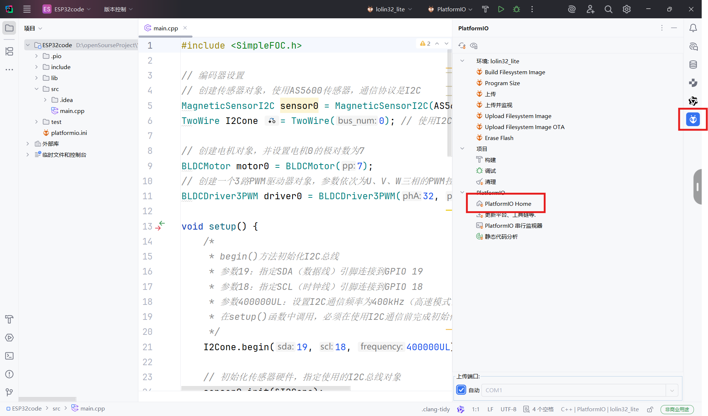
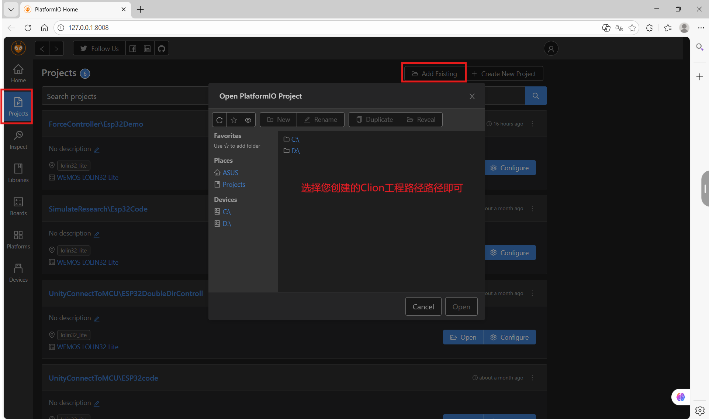
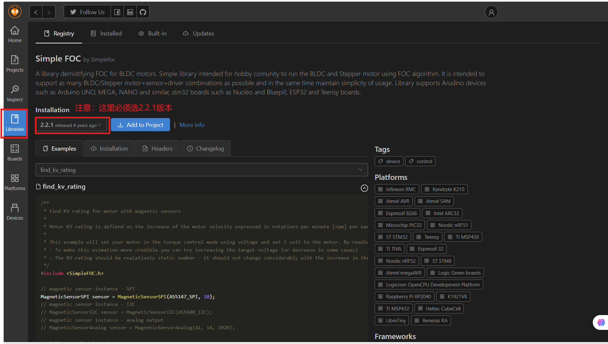
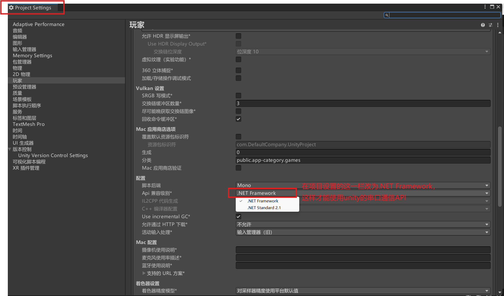

# 力反馈交互设备

一个 ESP32 和 Unity 的双向交互系统，通过无刷直流电机和磁编码器实现了位置同步和力反馈。

---

## 目录

- [项目结构](#项目结构)
- [安装教程](#安装教程)
- [硬件配置](#硬件配置)
- [ESP32 固件说明](#esp32-固件说明)
- [Unity 项目说明](#unity-项目说明)
- [通信协议](#通信协议)
- [技术栈](#技术栈)
- [注意事项](#注意事项)
- [故障排除](#故障排除)
- [应用场景](#应用场景)
- [许可证](#许可证)

---

## 项目结构

本项目分为 `ForceController`、`OppositeDirController` 和 `UnidirController` 三个模块，三者之间相互独立，分别测试了不同的功能。

```
VR_Project/
├── ForceController/          # 力反馈控制模块
│   ├── Esp32Demo/           # ESP32 固件
│   │   └── src/
│   │       └── main.cpp     # 电机控制主程序
│   └── UnityProject/        # Unity 项目
│       └── Assets/
│           └── Scripts/
│               ├── SerialController.cs    # 串口通信基类
│               ├── AddForce.cs            # 力反馈控制
│               └── Monitor.cs             # 数据监控
├── OppositeDirController/    # 位置控制模块
│   ├── ESP32code/           # ESP32 固件
│   │   └── src/
│   │       └── main.cpp     # 电机控制主程序
│   └── UnityProject/        # Unity 项目
│       └── Assets/
│           └── Scripts/
│               ├── SerialController.cs    # 串口通信基类
│               └── PosController.cs       # 位置控制
└── UnidirController/         # 电机位置读取模块
    ├── ESP32code/           # ESP32 固件
    │   └── src/
    │       └── main.cpp     # 电机控制主程序
    └── UnityProject/        # Unity 项目
        └── Assets/
            └── Scripts/
                ├── SerialController.cs    # 串口通信基类
                └── ReadData.cs            # 电机位置数据读取
```

> ⚠️ **注意**: ForceController 模块的功能尚不稳定，容易出现边界抖动。建议转动电机时将电机输出摇臂和底座握紧，且用力不用过大。在 Unity 中设置碰撞扭矩值小一些也能一定程度上缓解该问题。

---

## 安装教程

### ESP32 固件

1. 安装 CLion（个人习惯 CLion 作为 IDE，也可以使用 VSCode，或者 Arduino 原生 IDE）：[https://www.jetbrains.com/clion/](https://www.jetbrains.com/clion/)
2. 安装 PlatformIO：教程地址：【从零学习 Arduino Uno R4 配套教程 CLion（持续更新中）】[https://www.bilibili.com/video/BV1ku411j7oS?vd_source=72f0056fa0df6b22791b0b410c0bcae1](https://www.bilibili.com/video/BV1ku411j7oS?vd_source=72f0056fa0df6b22791b0b410c0bcae1)

安装完成后，如果您想创建自己的新项目，请按照如下图所示的方法将 SimpleFOC 库（其他固件库也可以用此方法导入到 PlatformIO 项目中）添加到 PlatformIO 项目中：

```



```

### Unity 项目

1. 安装 Unity（Unity 2022.3.15f1，选择一个长期支持版即可）
2. 安装 Rider（个人习惯 Rider 作为编程 IDE，也可以使用 VS，VSCode）：[https://www.jetbrains.com/rider/](https://www.jetbrains.com/rider/)
3. 使用 Unity 打开对应的项目目录
4. 配置串口名称（在 Inspector 中设置 SerialController 的 Port Name）
5. 连接 ESP32 到电脑
6. 运行 Unity 场景（在 Unity 中点击 Play 按钮）

如果您想建立自己的 Unity 新项目，创建项目后，需要做如下图所示的设置：

```

```

在 Preferences 设置里选择编程 IDE：Rider、VS、VSCode 均可。

---

## 硬件配置

### 核心组件

| 组件 | 型号/说明 |
|------|-----------|
| **微控制器** | ESP32 |
| **电机** | 2208 无刷直流电机（BLDC） |
| **传感器** | AS5600 磁编码器（I2C 通信） |
| **驱动器** | 灯哥 FOC 驱动板 |
| **购买链接** | [淘宝](https://e.tb.cn/h.7zRc5YoAeCNxXJd?tk=VjSeUpjhwDS) |

### 引脚定义

| 功能 | 引脚 |
|------|------|
| PWM U 相 | GPIO 32 |
| PWM V 相 | GPIO 33 |
| PWM W 相 | GPIO 25 |
| 驱动使能 | GPIO 12 / GPIO 22 |
| I2C SDA | GPIO 19 |
| I2C SCL | GPIO 18 |

### 电机参数

- 极对数: 7
- 供电电压: 12V
- 最大速度: 20 rad/s
- I2C 频率: 400 kHz

---

## ESP32 固件说明

### 主要功能

- 接收串口控制指令（格式: `T<指令值>`）
- 通过串口实时上传电机角度数据
- 使用 SimpleFOC 库实现无刷电机的控制

---

## Unity 项目说明

### SerialController（抽象基类）

提供串口通信的基础功能，所有业务逻辑继承此基类。

主要功能:

- 串口自动连接和重连
- 多线程读写：主线程处理 Unity 事件，子线程通过互斥锁处理串口数据
- 自动查找可用串口

可配置参数:

| 参数 | 默认值 | 说明 |
|------|--------|------|
| Port Name | COM3 | 串口名称 |
| Baud Rate | 115200 | 波特率 |
| Target Cube | - | Unity 中的目标物体（电机的位置数据要同步到该物体上） |

### AddForce

实现力反馈控制，根据碰撞状态发送扭矩指令。

主要功能:

- 检测与墙体碰撞
- 判断碰撞方向（顺时针/逆时针）
- 根据碰撞状态发送持续扭矩
- 实时同步电机角度到 Unity 物体

可配置参数:

| 参数 | 默认值 | 说明 |
|------|--------|------|
| Continuous Torque | 3f | 持续扭矩值 |

碰撞检测逻辑:

- 使用 `OnCollisionEnter` 检测碰撞开始
- 使用 `OnCollisionStay` 检测碰撞持续
- 使用 `OnCollisionExit` 检测碰撞结束
- 通过叉积计算碰撞方向

### Monitor

监控串口接收的角度数据并输出到调试控制台。

### ReadData

读取串口角度数据并同步到 Unity 物体旋转。

主要功能:

- 接收 ESP32 发送的角度数据
- 同步角度到目标物体的 Y 轴旋转
- 线程安全的数据处理

---

## 通信协议

### Unity → ESP32

```text
格式: T<扭矩值>
示例: T3.50
说明: 发送扭矩控制指令，正值为逆时针，负值为顺时针
```

### ESP32 → Unity

```text
格式: <角度值>
示例: 45.67
说明: 发送当前电机角度（度），保留两位小数
```

---

## 技术栈

### ESP32

| 技术 | 说明 |
|------|------|
| **C++** | 电机控制代码使用 C++ 语言编写 |
| **SimpleFOC** | 无刷直流电机 FOC 控制库 |
| **Arduino** | ESP32 开发框架 |
| **PlatformIO** | 跨平台开发环境 |
| **电机控制算法** | MIT 协议，力矩控制 |
| **I2C 通信** | 读取磁编码器角度与 ESP32 主控进行通信 |
| **UART 通信** | 与 Unity 进行数据交互 |

### Unity

| 技术 | 说明 |
|------|------|
| **C#** | 用 C# 脚本语言编写，主要负责处理用户输入、更新场景状态、与 ESP32 通信等 |
| **System.IO.Ports** | 串口通信 |
| **UnityEngine** | 游戏引擎 API，用于创建场景、添加组件、处理事件等 |
| **物理引擎** | 用 Rigidbody 组件模拟碰撞和物理效果 |
| **多线程编程** | 主线程处理 Unity 事件，子线程通过互斥锁处理串口数据，避免阻塞主线程 |

---

## 注意事项

| 项目 | 说明 |
|------|------|
| **串口连接** | 确保 ESP32 连接到正确的 COM 端口 |
| **电压安全** | 电机供电电压必须与配置一致（12V） |
| **电机校准** | 首次运行时需要进行电机校准（FOC 初始化） |
| **碰撞检测** | ForceController 需要在场景中添加名为 "Wall" 的碰撞体 |
| **线程安全** | Unity 串口通信使用多线程，注意数据同步 |

---

## 故障排除

### 串口连接失败

- 检查 COM 端口是否正确
- 确认 ESP32 已连接并供电
- 查看设备管理器中的端口列表

### 电机不转动

- 检查驱动器使能引脚连接
- 确认供电电压正常

### 角度读取异常

- 检查 I2C 连接（SDA/SCL）
- 确认 AS5600 传感器供电
- 检查 I2C 总线频率设置

### Unity 角度不同步

- 检查串口数据格式
- 确认波特率设置一致
- 查看 Unity 控制台错误信息

---

## 应用场景

- VR 力反馈手套
- 虚拟手术模拟
- 工业培训仿真
- 游戏力反馈设备
- 机器人遥操作

---

## 许可证

本项目仅供学习和研究使用。
